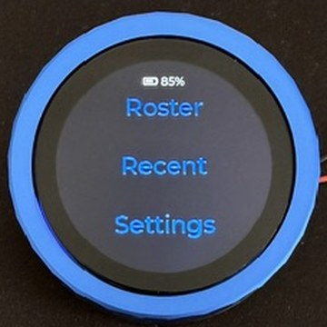
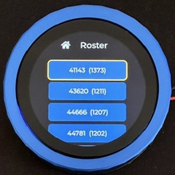
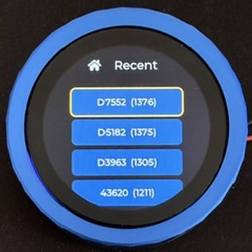
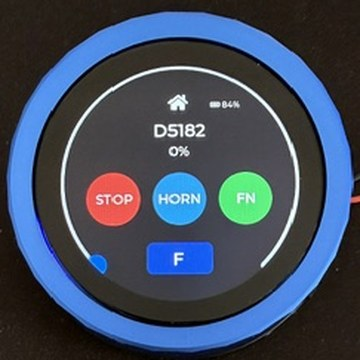
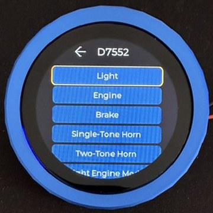

# WiThrottle Dial

A standalone, full single-loco JMRI WiThrottle throttle for the Waveshare ESP32-S3 Knob (360 × 360 round touch display). The dial connects directly to a JMRI WiThrottle server over Wi-Fi – browse the roster, acquire a loco, drive it with the rotary encoder around a 270° speed arc, change direction, sound the horn, toggle up to 32 functions, and emergency-stop. Recently driven locos are remembered in NVS across power cycles.

## Screens

| Home | Roster | Recent | Throttle | Functions |
|:---:|:---:|:---:|:---:|:---:|
|  |  |  |  |  |

## Hardware

[Waveshare ESP32-S3 Knob Touch LCD 1.8"](https://www.waveshare.com/esp32-s3-knob-touch-lcd-1.8.htm)

- ESP32-S3 dual-core, 8 MB PSRAM, 16 MB flash
- 360 × 360 round touch display
- Rotary encoder with push button

## Features

- **Roster browser** – lists the JMRI roster, sorted by name; the encoder scrolls the list.
- **Recents** – the locos you have driven before, persisted in NVS and survive a power cycle.
- **270° speed arc** – the encoder sweeps a circular speed arc; the JMRI throttle tracks it live.
- **Direction** – toggle forward/reverse.
- **32-function screen** – a scrolling list of named functions; tap to toggle each in JMRI.
- **Horn** – a dedicated control; the horn function index is auto-detected from the loco's function labels (falls back to F2).
- **Emergency stop** – immediate e-stop; the arc turns red.
- **mDNS auto-discovery** – finds the JMRI WiThrottle server on the network (`_withrottle._tcp`) automatically, with a saved-IP fallback and a picker when several servers are present.
- **On-device Wi-Fi/JMRI provisioning** – a SoftAP captive portal (`WiThrottle-Setup`); configure Wi-Fi and JMRI from a phone browser, no recompile or serial needed. Entered automatically on first boot / repeated Wi-Fi failure, or via **Settings → Reconfigure Wi-Fi**.

## Navigation map

| Screen | Control | Goes to |
|---|---|---|
| Connecting | (automatic) steps Wi-Fi → JMRI session → roster | Home, once ready |
| Home | Select Train | Roster |
| Home | Recents | Recent |
| Home | Settings | Settings |
| Roster | tap a loco row | acquires loco → Throttle |
| Roster | Back | Home |
| Recent | tap a loco row | acquires loco → Throttle |
| Throttle | Fn | Functions |
| Throttle | Back | releases loco → Home |
| Functions | Back | Throttle |
| Settings | Back | Home |

If Wi-Fi or the JMRI session drops while driving, the Throttle and Functions screens fall back to the Connecting screen automatically; once the connection recovers, it advances back to Home without a reboot.

## Configuration

You have three layers, in precedence order: **on-device provisioning / NVS parameters** override **compile-time defaults** in `src/secrets.h`. You do not need to set `secrets.h` at all if you provision on-device.

### On-device provisioning (no build, no serial)

Flash the firmware as-is. With no usable Wi-Fi it brings up a SoftAP named **`WiThrottle-Setup`**; join it from a phone and a configuration page opens automatically (captive portal). Choose your network, enter the password, optionally set a JMRI IP (otherwise it is auto-discovered via mDNS), and save — the device stores the values in NVS and reboots onto your network. You can re-run this any time from **Settings → Reconfigure Wi-Fi**. The JMRI server is found automatically by mDNS where available.

### Compile-time defaults (`src/secrets.h`)

`src/secrets.h` is git-ignored. Copy the tracked template and fill in your values:

```bash
cp src/secrets.h.example src/secrets.h
# then edit src/secrets.h
```

```cpp
#define SECRET_WIFI_SSID     "your-ssid"
#define SECRET_WIFI_PASSWORD "your-password"
#define SECRET_JMRI_IP       "192.168.1.7"
#define SECRET_JMRI_PORT     12090
```

### Runtime overrides (serial console)

Connect a serial terminal (115200 baud) and set parameters, then persist them:

```
param set wifi_ssid     "YourNetwork"
param set wifi_password  "YourPassword"
param set jmri_ip        "192.168.1.7"
param set jmri_port      12090
param set udp_log_ip     "192.168.1.160"
param save
```

| Key | Default | Description |
|---|---|---|
| `wifi_ssid` | `SECRET_WIFI_SSID` | Wi-Fi network name |
| `wifi_password` | `SECRET_WIFI_PASSWORD` | Wi-Fi password |
| `jmri_ip` | `SECRET_JMRI_IP` | JMRI WiThrottle server host |
| `jmri_port` | `SECRET_JMRI_PORT` | JMRI WiThrottle server port |
| `udp_log_ip` | *(empty)* | If set, mirror logs over UDP to this host (port 4444). Empty disables UDP logging. |

## Building and flashing

This is a native ESP-IDF project driven through `./build.sh` (a wrapper around `idf.py`).

The WiThrottleProtocol library is a **git submodule**, so clone with `--recurse-submodules` (or initialise it after cloning):

```bash
git clone --recurse-submodules https://github.com/honzup/waveshare_withrottle_dial.git
# or, if already cloned:
git submodule update --init --recursive
```

```bash
# Build the firmware
./build.sh build

# USB flash, then open the serial monitor (board connected)
./build.sh flash monitor

# Serial monitor only
./build.sh monitor

# Wireless OTA update (default IP 192.168.1.209)
./build.sh ota

# Wireless OTA to a specific IP
./build.sh ota 192.168.1.x
```

After the first USB flash, subsequent updates can be done wirelessly via OTA. The `ota` subcommand uses the `espota.py` protocol over UDP 3232.

## Tests

Pure-logic modules (`loco_ref`, `horn_resolver`, `recents_serialize`) have native Unity tests that compile and run off-device with g++:

```bash
bash test/native/run.sh            # run all native tests
bash test/native/run.sh loco_ref   # run one suite
```

## Manual on-device verification checklist

```
[ ] Boot → connecting screen steps Wi-Fi → JMRI → roster → Home
[ ] Roster lists locos, sorted by name; encoder scrolls
[ ] Tap loco → acquires, shows on throttle, name correct
[ ] Encoder rotates → speed arc tracks, JMRI throttle moves
[ ] Direction toggles F/R
[ ] HORN: hold sounds, release silences (correct function)
[ ] Fn screen lists named functions; tap toggles in JMRI
[ ] STOP → emergency stop, arc red
[ ] Back → loco released in JMRI, returns Home
[ ] Recents lists prior locos; persists across power cycle
[ ] Drop Wi-Fi → connecting screen returns; reconnect recovers
```

## Project structure

```
src/
  secrets.h.example  – committed template for compile-time Wi-Fi/JMRI defaults
  secrets.h          – git-ignored real credentials (copy of the template)
components/
  withrottle_client/ – direct JMRI WiThrottle client; implements the withr:: API
  withrottle/        – git submodule → honzup/WiThrottleProtocol (CC BY-SA 4.0; see its LICENSE)
  jmri_discovery/    – mDNS discovery of the JMRI WiThrottle server (pure choose() is native-testable)
  netprov/           – SoftAP captive-portal Wi-Fi/JMRI provisioning (pure validators native-testable)
  loco_ref/          – pure loco value type + address parsing (native-testable)
  horn_resolver/     – pure horn function-index resolver (native-testable)
  recents/           – NVS-backed recents (pure serialise + Param persistence)
  ui_screens/        – screen manager + per-screen modules
  ui/                – LVGL display init and generated UI sources
  ota_server/        – espota-compatible OTA server (UDP 3232)
  wifi/              – Wi-Fi station mode with NVS credential storage
  param/             – NVS-backed key/value parameter store
  udp_log/           – optional UDP log mirror
main/
  main.cpp           – app entry point, encoder task, UI update loop
sq_studio_prj/       – SquareLine Studio project (UI design source)
partitions.csv       – OTA partition table (app0 + app1, ~4 MB each)
test/                – native Unity tests
```

## Versioning

The splash shows the release version (from the latest `vX.Y` git tag) and a small build id (`git describe`) for traceability. To cut a release, tag it — `git tag -a v1.2 -m "…"` — and the next build picks it up automatically.

## Licence

This project's own code is **MIT** (see [`LICENSE`](LICENSE)). It uses third-party components under their own licences — most importantly the **WiThrottleProtocol** library (a git submodule, [`honzup/WiThrottleProtocol`](https://github.com/honzup/WiThrottleProtocol)), which is **CC BY-SA 4.0** (attribution + share-alike), not MIT. See [`THIRD_PARTY_NOTICES.md`](THIRD_PARTY_NOTICES.md) for the full list and attribution.

## Acknowledgements

This project began from **[`len0rd/withrottle_dial`](https://github.com/len0rd/withrottle_dial)** by **Tyler Miller ([@len0rd](https://github.com/len0rd))** — the original proof-of-concept WiThrottle controller for the Waveshare ESP32 dial, now **MIT-licensed** (© 2026 len0rd). The **SquareLine UI design** (the home / roster / settings screens under `sq_studio_prj/` and `components/ui/generated/`) originates from his work and is used here under that MIT licence with attribution. The application logic (WiThrottle client, screen manager, settings store, console, provisioning, recents, OTA, …) was independently re-authored for this project.

The WiThrottleProtocol library is consumed as a git submodule from **[`honzup/WiThrottleProtocol`](https://github.com/honzup/WiThrottleProtocol)**, a fork of the upstream **[`flash62au/WiThrottleProtocol`](https://github.com/flash62au/WiThrottleProtocol)** whose ESP-IDF adaptation (CMake + Arduino-compat shim) was contributed by @len0rd and is redistributed under CC BY-SA 4.0.

Huge thanks for the foundation. See [`THIRD_PARTY_NOTICES.md`](THIRD_PARTY_NOTICES.md) for licensing details.
